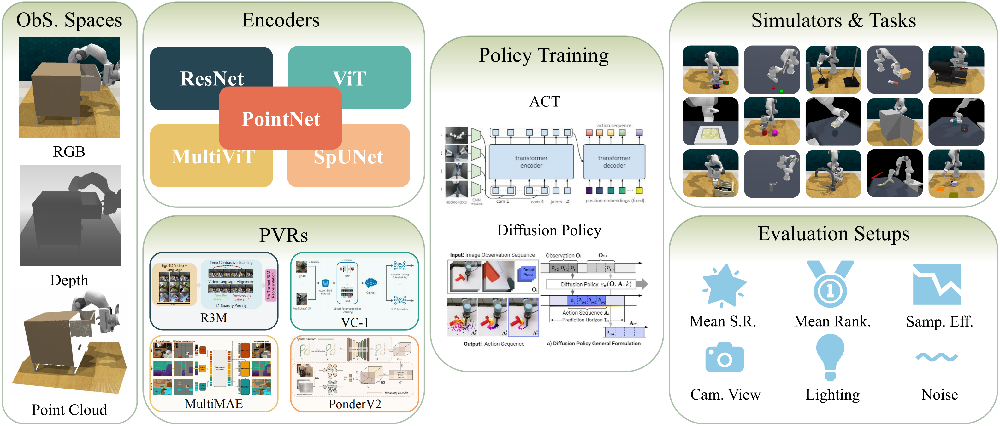

<div align="center">

# Point Cloud Matters: Rethinking the Impact of Different Observation Spaces on Robot Learning

[](https://github.com/pre-commit/pre-commit)
[](https://pytorch.org/get-started/locally/)
[](https://pytorchlightning.ai/)
[](https://hydra.cc/)
[](https://black.readthedocs.io/en/stable/)
[](https://pycqa.github.io/isort/)
[](https://github.com/ashleve/lightning-hydra-template#license)

[**Project Page**](https://haoyizhu.github.io/PointCloudMatters.github.io/) | [**Arxiv**](https://arxiv.org/abs/2402.02500)

[Haoyi Zhu](https://www.haoyizhu.site/), [Yating Wang](https://scholar.google.com/citations?hl=zh-CN&user=5SuBWh0AAAAJ), [Di Huang](https://dihuang.me/), [Weicai Ye](https://ywcmaike.github.io/), [Wanli Ouyang](https://wlouyang.github.io/), [Tong He](http://tonghe90.github.io/)
</div>

<p align="center">
    
</p>

This is the official implementation of paper "Point Cloud Matters: Rethinking the Impact of Different Observation Spaces on Robot Learning".

In robot learning, the observation space is crucial due to the distinct characteristics of different modalities, which can potentially become a bottleneck alongside policy design. In this study, we explore the influence of various observation spaces on robot learning, focusing on three predominant modalities: RGB, RGB-D, and point cloud. We introduce OBSBench, a benchmark comprising two simulators and 125 tasks, along with standardized pipelines for various encoders and policy baselines. Extensive experiments on diverse contact-rich manipulation tasks reveal a notable trend: point cloud-based methods, even those with the simplest designs, frequently outperform their RGB and RGB-D counterparts. This trend persists in both scenarios: training from scratch and utilizing pre-training. Furthermore, our findings demonstrate that point cloud observations often yield better policy performance and significantly stronger generalization capabilities across various geometric and visual conditions. These outcomes suggest that the 3D point cloud is a valuable observation modality for intricate robotic tasks. We also suggest that incorporating both appearance and coordinate information can enhance the performance of point cloud methods. We hope our work provides valuable insights and guidance for designing more generalizable and robust robotic models.


## :clipboard: Contents

- [Project Structure](#telescope-project-structure)
- [Installation](#installation)
- [Data Preparation](#mag-data-preparation)
- [Training and Evaluation](#rocket-training-and-evaluation)
- [Trouble Shooting](#bulb-trouble-shooting)
- [License](#books-license)
- [Acknowledgement](#sparkles-acknowledgement)
- [Citation](#pencil-citation)


## :telescope: Project Structure

Our codebase draws significant inspiration from the excellent [Lightning Hydra Template](https://github.com/ashleve/lightning-hydra-template). The directory structure of this project is organized as follows:

<details>
<summary><b>Show directory structure</b></summary>

```
├── .github                   <- Github Actions workflows
│
├── configs                   <- Hydra configs
│   ├── callbacks                         <- Callbacks configs
│   ├── data                              <- Data configs
│   ├── debug                             <- Debugging configs
│   ├── exp_maniskill2_act_policy         <- ManiSkill2 w. ACT policy experiment configs
|   ├── exp_maniskill2_diffusion_policy   <- ManiSkill2 w. diffusion policy experiment configs
│   ├── extras                            <- Extra utilities configs
│   ├── hydra                             <- Hydra configs
│   ├── local                             <- Local configs
│   ├── logger                            <- Logger configs
│   ├── model                             <- Model configs
│   ├── paths                             <- Project paths configs
│   ├── trainer                           <- Trainer configs
|   |
│   └── train.yaml            <- Main config for training
│
├── data                   <- Project data, e.g. ManiSkill2 replayed trajectories
│
├── logs                   <- Logs generated by hydra and lightning loggers
│
├── scripts                <- Shell scripts
|
├── src                    <- Source code
│   ├── data                     <- Data scripts
│   ├── models                   <- Model scripts
│   ├── utils                    <- Utility scripts
│   │
│   ├── validate.py              <- Run evaluation
│   └── train.py                 <- Run training
│
├── .gitignore                <- List of files ignored by git
├── .project-root             <- File for inferring the position of project root directory
├── requirements.txt          <- File for installing python dependencies
├── setup.py                  <- File for installing project as a package
└── README.md
```

</details>

## :hammer: Installation

<details>
<summary><b>Basics</b></summary>

```bash
# clone project
git clone https://github.com/HaoyiZhu/PointCloudMatters-dev.git
cd PointCloudMatters

# crerate conda environment
conda create -n pcm python=3.11 -y
conda activate pcm

# install PyTorch, please refer to https://pytorch.org/ for other CUDA versions
# e.g. cuda 11.8:
pip3 install torch torchvision torchaudio --index-url https://download.pytorch.org/whl/cu118
# install basic packages
pip3 install -r requirements.txt
```
</details>

<details>
<summary><b> Point cloud related</b></summary>

```bash
# please install with your PyTorch and CUDA version
# e.g. torch 2.3.0 + cuda 118:
pip install torch-scatter torch-sparse torch-cluster -f https://data.pyg.org/whl/torch-2.3.0+cu118
```
> **Note**: `spconv` must matches your CUDA version, see [official Github](https://github.com/traveller59/spconv) for more information.
```bash
# e.g. for CUDA 11.8:
pip3 install spconv-cu118
```
```bash
# build FPS sampling operations (CUDA required)
cd libs/pointops
# docker & multi GPU arch
TORCH_CUDA_ARCH_LIST="ARCH LIST" python setup.py install
# e.g. 7.5: RTX 3000; 8.0: a100 More available in: https://developer.nvidia.com/cuda-gpus
TORCH_CUDA_ARCH_LIST="7.5 8.0" python setup.py install
cd ../..
```

</details>

<details>
<summary><b> ManiSkill2 </b></summary>

```bash
pip install mani-skill2==0.5.3 && pip cache purge
```

You can test whether your `ManiSkill2` is installed successfully by running:
```bash
python -m mani_skill2.examples.demo_random_action
```

</details>

<details>
<summary><b> RLBench </b></summary>

Coming soon.


</details>


## :mag: Data Preparation

<details>
<summary><b> ManiSkill2 </b></summary>

You can simply run the following to download and replay demonstrations:
```bash
bash scripts/download_and_replay_maniskill2.sh
```

</details>

<details>
<summary><b> RLBench </b></summary>
Coming soon.
</details>

## :rocket: Training and Evaluation

<details>
<summary><b> ManiSkill2 </b></summary>

- Train with RGB(-D) image observation:
  ```bash
  # ACT policy example:
  python src/train.py exp_maniskill2_act_policy=base exp_maniskill2_act_policy/maniskill2_task@maniskill2_task=${task} exp_maniskill2_act_policy/maniskill2_model@maniskill2_model=${model}
  # Diffusion policy example:
  python src/train.py exp_maniskill2_diffusion_policy=base exp_maniskill2_diffusion_policy/maniskill2_task@maniskill2_task=${task} exp_maniskill2_diffusion_policy/maniskill2_model@maniskill2_model=${model}
  ```

- Train with point cloud observation:
  ```bash
  # ACT policy example:
  python src/train.py exp_maniskill2_act_policy=base exp_maniskill2_act_policy/maniskill2_pcd_task@maniskill2_pcd_task=${task} exp_maniskill2_act_policy/maniskill2_model@maniskill2_model=${model}
  # Diffusion policy example:
  python src/train.py exp_maniskill2_diffusion_policy=base exp_maniskill2_diffusion_policy/maniskill2_pcd_task@maniskill2_pcd_task=${task} exp_maniskill2_diffusion_policy/maniskill2_model@maniskill2_model=${model}
  ```

- Evaluate a checkpoint:
  ```bash
  python src/validate.py exp_maniskill2_act_policy=base exp_maniskill2_act_policy/maniskill2_pcd_task@maniskill2_pcd_task=${task} exp_maniskill2_act_policy/maniskill2_model@maniskill2_model=${model} ckpt_path=${path/to/checkpoint}
  ```
  
Detailed configurations can be found in [configs/exp_maniskill2_act_policy](configs/exp_maniskill2_act_policy) and [configs/exp_maniskill2_diffusion_policy](configs/exp_maniskill2_diffusion_policy).

Currently supported tasks can be found in [configs/exp_maniskill2_act_policy/maniskill2_task](configs/exp_maniskill2_act_policy/maniskill2_task), [configs/exp_maniskill2_act_policy/maniskill2_pcd_task](configs/exp_maniskill2_act_policy/maniskill2_pcd_task), [configs/exp_maniskill2_diffusion_policy/maniskill2_task](configs/exp_maniskill2_diffusion_policy/maniskill2_task) and [configs/exp_maniskill2_diffusion_policy/maniskill2_pcd_task](configs/exp_maniskill2_diffusion_policy/maniskill2_pcd_task).

Currently supported models can be found in [configs/exp_maniskill2_act_policy/maniskill2_model](configs/exp_maniskill2_act_policy/maniskill2_model) and [configs/exp_maniskill2_diffusion_policy/maniskill2_model](configs/exp_maniskill2_diffusion_policy/maniskill2_model).


</details>

<details>
<summary><b> RLBench </b></summary>
Coming soon.
</details>

## :bulb: Trouble Shooting

See [TroubleShooting.md](TroubleShooting.md).

## :books: License

This repository is released under the [MIT license](LICENSE).

## :sparkles: Acknowledgement

Our code is primarily built upon [Pytorch Lightning](https://github.com/Lightning-AI/pytorch-lightning), [Hydra](https://github.com/facebookresearch/hydra), [Lightning Hydra Template](https://github.com/ashleve/lightning-hydra-template), [ManiSkill2](https://github.com/haosulab/ManiSkill), [RLBench](https://github.com/stepjam/RLBench), [PerAct](https://github.com/peract/peract), [ACT](https://github.com/tonyzhaozh/act), [Diffusion Policy](https://github.com/real-stanford/diffusion_policy), [TIMM](https://github.com/huggingface/pytorch-image-models), [PonderV2](https://github.com/OpenGVLab/PonderV2), [MultiMAE](https://github.com/EPFL-VILAB/MultiMAE), [VC1](https://github.com/facebookresearch/eai-vc), [R3M](https://github.com/facebookresearch/r3m). We extend our gratitude to all these authors for their generously open-sourced code and their significant contributions to the community.

## :pencil: Citation

```bib
@article{zhu2024point,
  title={Point Cloud Matters: Rethinking the Impact of Different Observation Spaces on Robot Learning},
  author={Zhu, Haoyi and Wang, Yating and Huang, Di and Ye, Weicai and Ouyang, Wanli and He, Tong},
  journal={arXiv preprint arXiv:2402.02500},
  year={2024}
}
```